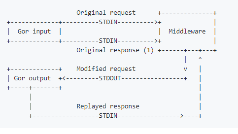

# GoReplay middleware, 中间件

GoReplay提供了NodeJS编写的基础框架，它隐藏了协议实现的细节并提供了中间件编写的基础语句。不过协议本身十分简单，可以使用任何语言编写。

中间件是一个从标准输入接收请求和响应并输出更改后的请求到标准输出的程序，你可以实现任何自定义逻辑，比如分离隐私数据、高级重写、oAuth认证等。



中间件程序与Gor的所有通信都是异步的，不能保证原始请求和响应消息一个接一个的到来，如果处理的逻辑依赖原始响应(original response)和复制的响应(replayed response)，中间件要增加状态的处理。

启用中间件使用`--middleware`选项：
```sh
gor --input-raw :80 --middleware "/opt/middleware_executable" --output-http "http://staging.server"
```

## 交流协议

所有的消息都应该是十六进制编码的，新的行字符指定消息的结尾。解码的有效载荷有两部分组成：header和HTTP载荷

请求载荷例子：
```
1 932079936fa4306fc308d67588178d17d823647c 1439818823587396305
GET /a HTTP/1.1
Host: 127.0.0.1
```

响应载荷例子：
```
2 8e091765ae902fef8a2b7d9dd960e9d52222bd8c 1439818823587996305 2782013
HTTP/1.1 200 OK
Date: Mon, 17 Aug 2015 13:40:23 GMT
Content-Length: 0
Content-Type: text/plain; charset=utf-8
```

header包含请求元信息，通过空格区隔，第一个参数表示载荷类型，可能的取值：1表示request，2表示original response，3表示replayed response；第二个参数是请求id（sha1 of time and Ack），对所有请求来说这个id是独一无二的，但请求对应的original response和replayed response是一致的，可以通过id在请求和响应之间建立联系；第三个参数是请求/响应启动/接收的时间；第四个参数仅出现在响应载荷中，表示延迟。

